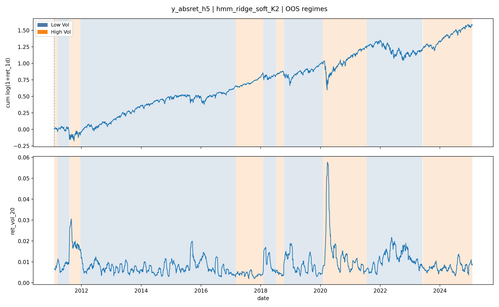

# regime-forecasting

# Regime-Aware Time-Series Forecasting for Equity Markets
This project implements code for regime-aware time-series forecasting on equity data, primarily SPY. It has a focus on strict causality, volatility stress testing, and interpretability.

The core idea is to combine online Hidden Markov Models (HMMs) for regime detection with regime-conditioned linear predictors. With the results of this program, I evaluate whether regime awareness improves forecasting performance, especially when volatility is elevated (i.e. 2008 Financial Crisis, COVID-19 market crash in 2020, etc.).

---

## Key Contributions
* Strictly causal regime detection
    * Custom HMM filtering with no lookahead
    * Online inference only on information available at prediction time
* Regime-conditioned forecasting
    * Ridge regressoin conditioned on inferred market regimes
    * Both _hard_ (argmax) and _soft_ (probability-weighted) regime conditioning
* Evaluation protocol
    * Walk-forward eval with strict train/test separation
    * Multiple forecast horizons (1, 5, 20)
    * Stress testing on current & future volatilit regimes
* Interpretability & diagnostics
    * Regime transition matrices and stationary distributions
    * Regime-conditional performance metrics
    * Regime shading plots over returns and volatility

---
## Problem Setting
We study forecasting tasks of the form:
* Targets
    * Returns
    * Absolute returns
    * Squared returns at horizons $h \in {1, 5, 20}$
* Goal
    * Predict future returns / volatility
    * Evaluate whether conditioning on latent market regimes improves:
        * RMSE/MAE
        * Rank Correlation
        * Performance during volatility spikes

---
## Data & Features
* Asset: SPY (S&P 500 ETF)
* Feature engineering includes:
    * Lagged daily returns (ret_lag_k)
    * Rolling means of returns
    * Rolling realized volatility (ret_vol_5, ret_vol_10, ret_vol_20)
* Targets:
    * Stored as y_<type>_h<horizon> (e.g. y_absret_h5)

All features and targets are generated through a reproducible preprocessing pipeline.

---
## Models
### Baselines
* Zero-return baseline
* Rolling mean
* Ridge regression

### Regime-Aware Models
* HMM-conditioned Ridge
    * HMM trained on engineered features
    * Regimes inferred online via filtering
    * Ridge regression conditioned on:
        * Hard regimes (argmax)
        * Soft regimes (probability-weighted)

---
## Evaluation Protocol
* Walk-forward evaluation
    * Rolling train/test windows
    * No retraining on test data
* Metrics
    * RMSE, MAE
    * Spearman rank correlation
    * Top-decile hit rate
* Stress testing
    * hv_now: top decile of current realized volatility
    * hv_fut: top decile of future realized volatility (target-define)

---
## Interpretability & Artifacts
Each experiment produces artifacts under:
```text
artifacts/
├── results/
│   ├── latest.csv
│   └── run_<timestamp>/
├── regimes/
│   └── <run_id>/
│       └── <target>/
│           └── <model>/
│               ├── hmm_interpretability.npz
│               ├── oos_regime_probs.csv
│               ├── per_regime_metrics.csv
│               └── plots/
│                   └── regime_shading.png
```

## Regime Shading Plots
* Hard regime boundaries (contiguous segments)
* Alpha (opacity) scaled by posterior confidence
* Overlaid on:
    * Cumulative log returns
    * Realized volatility
These plots validate that inferred regimes align with known market stress periods.

---
## Main Results

This section highlights representative results from the regime-aware forecasting pipeline,
focusing on interpretability and performance under market stress.

### Regime Structure and Market Stress

The figure below shows out-of-sample inferred market regimes for the best-performing
HMM-conditioned Ridge model at a 5-day horizon. Regime boundaries are defined by hard
state assignments, while shading opacity reflects posterior confidence. The top
panel shows cumulative log returns, and the bottom panel shows realized volatility.

Inferred regimes align closely with known periods of elevated market stress (e.g. 2011,
2015–16, 2018, 2020, and 2022), providing evidence that the online HMM captures meaningful
non-stationary structure without lookahead.



---

### Regime-Conditional Performance

Performance broken down by inferred regime at prediction time for the same model shown
above. High-volatility regimes account for a disproportionate share of future volatility
spikes (`hv_fut`), and regime-conditioned models exhibit improved performance during
these periods relative to unconditioned baselines.

| Regime    | Count | RMSE  | MAE   | Spearman | RMSE (hv_fut) | hv_fut frac |
|-----------|-------|-------|-------|----------|---------------|-------------|
| Low Vol   | 2161  | 0.0065| 0.0048| 0.227     | 0.016         | 0.045        |
| High Vol  | 1360   | 0.0094| 0.0057| 0.28     | 0.024         | 0.45        |

Full regime-conditional metrics, including additional horizons and model variants,
are saved as CSV artifacts under the `artifacts/regimes/` directory for each run.


---
## Reproducibility
**Environment**:
* Python 3.12
* Dependency management via uv
* OS: Windows (portable to Linux/macOS)

<code>python run_experiments.py</code>
This will:
1. Build the processed dataset
2. Run all baseline and regime-aware models
3. Save metrics, artifacts, and plots
4. Select best models per horizon

---
## Limitations & Future Work
* Linear predictors only (no nonlinear regime experts yet)
* Single-asset focus (SPY)
* Fixed regime count per experiment

Planned extensions:
* Regime-conditional nonliner models
* Multi-asset regime discovery
* Regime stability and drift analysis
* Formal ablation studies

---
## Why This Matters
Financial time series are non-stationary. This project demonstrates that explicit regime awareness, implemented carefully and evaluated rigorously, can improve forecasting performance, especailly during periods where naive models fail most.