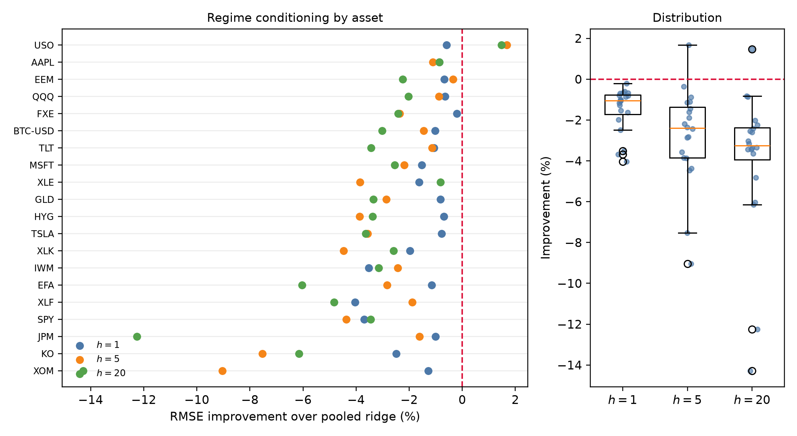
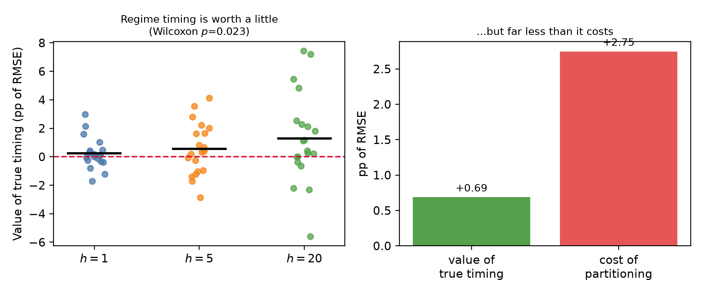
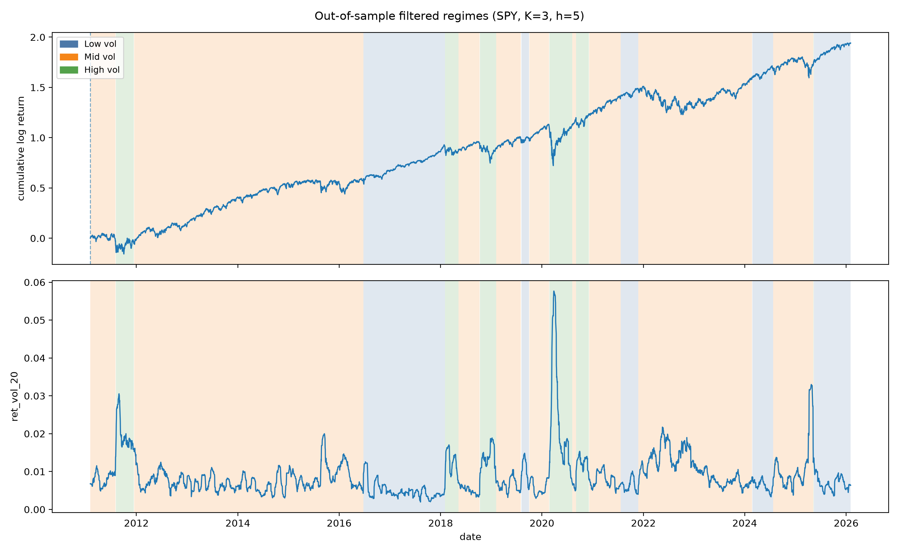

# Regime-Aware Volatility Forecasting: A Causal Re-Evaluation

Do HMM-inferred market regimes actually improve volatility forecasting?

This repository contains a strictly causal evaluation of regime-conditioned
forecasting on SPY (2005–2026), plus the accompanying paper. The short answer is
**no** — and the more useful result is that we can show precisely how a positive
answer gets manufactured by four common evaluation shortcuts.

> Research and educational purposes only. Not financial advice.

---

## Headline findings

1. **Regime conditioning does not help — on any of 20 assets.** Against properly
   specified benchmarks (HAR, GARCH(1,1), EWMA) and a tuned pooled ridge on
   identical features, the HMM regime-conditioned mixture loses in **58 of 60
   asset-horizon pairs** (median −2.3% RMSE), significantly in 37, and is
   significantly better in *none*. The universe spans equity indices, sectors,
   single names, rates, credit, commodities, FX and crypto.

   

2. **The regime signal is real but four times too small to pay for itself.**
   Shuffling the regime probabilities in time — correct marginal distribution,
   wrong day — costs **0.69 percentage points** of RMSE on average (Wilcoxon
   p=0.023), rising with horizon. So timing does carry information. But
   partitioning the training data across per-regime experts costs **2.75
   points**. That ratio, not an absence of signal, is the result.

   

3. **Four protocol shortcuts manufacture a significant positive result.**
   Starting from an aliased multi-horizon target, an unstandardized
   fixed-penalty baseline, no train/test embargo, and hyperparameters selected on
   the test score, the regime model shows a significant improvement. Removing
   them one at a time drives it to zero and then negative. Correcting the
   baseline alone flips the sign.

   | | h=1 | h=5 | h=20 |
   |---|---|---|---|
   | P0 as-published | **+1.93%** (p=0.001) | **+1.25%** (p=0.001) | +0.63% (p=0.183) |
   | P1 + tuned/standardized baseline | −1.03% | −0.37% | −0.23% |
   | P2 + train/test embargo | −1.06% | −0.34% | −0.19% |
   | P3 + nested selection | −3.69% | −1.02% | −0.76% |
   | P4 + realized-vol target | −3.69% | −4.37% | −3.45% |

   (Improvement of the regime model over its *matched* pooled-ridge baseline.
   At h=1 the aliased and realized-volatility targets coincide, so P3 = P4.)

4. **Seed-to-seed variation rivals the effect size.** Across 10 HMM
   initializations the improvement over pooled ridge ranges from −3.7% to −0.2%
   at h=1, −6.7% to −1.9% at h=5, and −5.2% to −2.4% at h=20 — spreads of 3–5
   percentage points, comparable to the differences being tested. The selected
   number of regimes is seed-dependent too. Every seed is negative, so the
   conclusion holds, but no single run measures the magnitude.

5. **The regimes themselves are real.** The filtered high-volatility state
   aligns with 2011, 2018, 2020 and 2022 without any lookahead. They are
   interpretable — just not *incrementally* useful for point forecasting.



---

## What makes the evaluation causal

* **Strict online filtering.** Regime probabilities are the *filtered* posterior
  `P(z_t | x_{1:t})`, computed with an explicit forward recursion. Using
  `hmmlearn`'s `predict_proba` (smoothed, conditions on the whole sequence) or
  `predict` (Viterbi) would be lookahead. The test-window filter is warm-started
  from the final training belief.
* **Embargoed walk-forward.** 6 years train / 1 year test, rolling by 1 year, 14
  folds. The last `h` training rows are purged because their targets extend into
  the test fold.
* **Nested selection.** `K ∈ {2,3,4}` and hard-vs-soft gating are chosen on a
  trailing validation block *inside* each training window, never on test data.
* **Matched baselines.** Every model sees the same features, including the three
  HAR components, and every ridge is standardized with its penalty tuned by GCV.
* **HAC significance testing.** Diebold–Mariano with Newey–West at lag `h−1`
  (overlapping targets autocorrelate the loss differential by construction), the
  Harvey–Leybourne–Newbold small-sample correction, and Holm–Bonferroni across
  comparisons.

## Targets

The headline target is realized volatility over the forecast window:

```
y_rv_h{h}(t) = sqrt( (1/h) * sum_{i=1..h} r_{t+i}^2 )
```

The repository also builds `y_absret_h{h}(t) = |r_{t+h}|` — a *point-in-time*
transform of a single future day. That is not a multi-horizon target: the three
horizons are the same series at different lags and have identical marginal
distributions. It is retained deliberately, as stage P0 of the protocol ablation.

---

## Running it

```bash
uv sync
```

Three entry points, each writing to `artifacts/study/`:

```bash
uv run python -m src.experiments.run_study
```

```bash
uv run python -m src.experiments.protocol_ablation
```

```bash
uv run python -m src.experiments.seed_robustness
```

```bash
uv run python -m src.experiments.multi_asset
```

Then regenerate every table and figure in the paper from those artifacts:

```bash
uv run python -m src.experiments.make_paper_tables
```

Build the paper:

```bash
cd paper && pdflatex main.tex && bibtex main && pdflatex main.tex && pdflatex main.tex
```

Tests:

```bash
uv run pytest -q
```

---

## Layout

```
src/
  data/           dataset build: leakage-free features and targets
  regime/         Gaussian HMM + explicit causal forward filter
  models/         baselines (HAR, GARCH, EWMA, RW, ridge) and regime mixture
  eval/           walk-forward splits, metrics, pooled OOS collection, DM tests
  experiments/    study drivers, ablations, table/figure generation
paper/            main.tex, references.bib, generated tables/ and figures/
artifacts/study/  all results, keyed by run id
tests/            correctness tests for the causal machinery
```

The pieces most worth reading are `src/regime/hmm.py` (the forward filter and
the canonical state ordering), `src/eval/oos.py` (the ablation design and nested
selection), and `src/experiments/protocol_ablation.py`.

---

## A checklist

Distilled from the audit that produced this paper:

1. Verify the target actually varies with the horizon — compare marginals across `h`.
2. Use filtered, not smoothed, state probabilities. Test it: delete data after `t` and check `γ_t` is unchanged.
3. Purge the training window by the horizon.
4. Select hyperparameters inside the training window.
5. Give the baseline the same care as the model — standardization, tuned regularization, same features. Include HAR and GARCH for volatility.
6. Run a gate-shuffle ablation. If shuffling regimes in time doesn't hurt, the regime signal isn't doing the work.
7. Check that your ablations aren't duplicates — two of ours returned bitwise-identical numbers.
8. Relabel HMM states canonically before pooling across folds, or per-regime tables mix different regimes together.
9. Report the seed distribution, not one run.
10. Test significance with HAC-corrected Diebold–Mariano and correct for multiple comparisons.

---

## License

MIT — see `LICENSE`.
