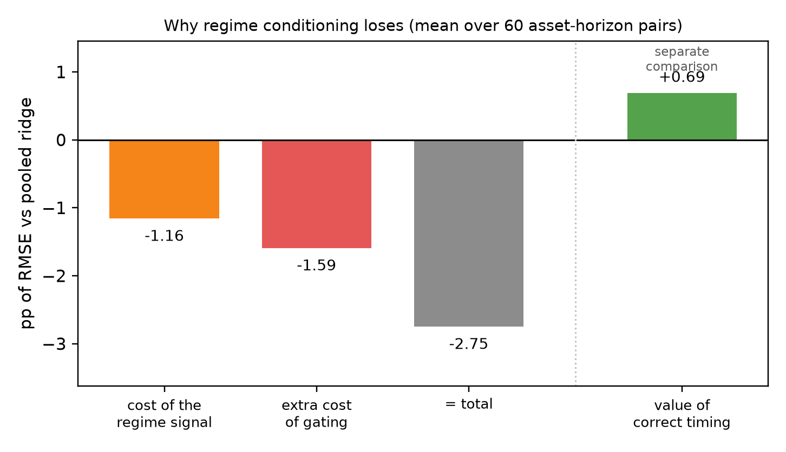
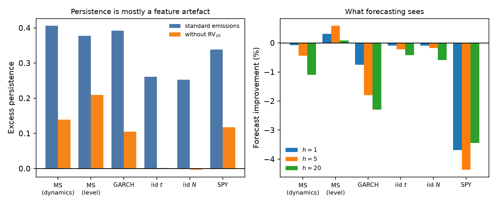

# What Do Hidden Markov Models Learn From Financial Returns?

Do HMM-inferred market regimes actually improve volatility forecasting?

This repository contains a strictly causal evaluation of regime-conditioned
forecasting across 20 assets (2005–2026), plus the accompanying paper. The short
answer is **no**, and the more useful results are *why* — the inferred regime is
96% redundant with a feature every model already has — and a demonstration of how
a significant positive answer gets manufactured by four evaluation shortcuts.

> Research and educational purposes only. Not financial advice.

---

## Headline findings

1. **Regime conditioning does not help — on any of 20 assets.** Against properly
   specified benchmarks (HAR, GARCH(1,1), EWMA) and a tuned pooled ridge on
   identical features, the HMM regime-conditioned mixture loses in **58 of 60
   asset-horizon pairs** (median −2.3% RMSE), significantly in 37, and is
   significantly better in *none*. The universe spans equity indices, sectors,
   single names, rates, credit, commodities, FX and crypto.

   

2. **Every route into the model loses — including the ones that avoid gating.**
   We tested all four: full gating, gating with a time-shuffled gate, gating
   shrunk toward the pooled fit, and the posteriors as plain features with no
   partition at all. Across **240 Diebold–Mariano tests, not one** shows a
   significant improvement.

   | Route | Median vs pooled ridge | Wins | Sig. better |
   |---|---|---|---|
   | Regime gating (full mixture) | −2.30% | 2/60 | **0** |
   | …with time-shuffled gate | −3.14% | 3/60 | **0** |
   | Gating shrunk to pooled | −0.72% | 11/60 | **0** |
   | Posteriors as features (no partition) | −0.63% | 4/60 | **0** |
   | GARCH(1,1) — *ignores regimes* | +0.59% | 39/60 | 4 |

3. **The cost decomposes, and it isn't only the mechanism.** Injecting the regime
   signal at all costs **1.16pp** of RMSE (Wilcoxon p=2.4e−9); gating on it costs
   a further **1.59pp** (p=8.7e−8); correct timing returns only **+0.69pp**.

   

4. **The mechanism is redundancy.** The HMM's hard state is **95.7% recoverable
   from the three HAR components alone** (base rate 46.2%). It is a noisy,
   three-level, annually-refitted re-encoding of a quantity every model already
   reads continuously. That's why no way of injecting it helps.

5. **The null is measured, not merely unrejected.** Equivalence bounds report
   what size of improvement the data exclude. In the median asset-horizon pair,
   *no* improvement of any size is consistent with the evidence at 95%.

6. **It survives three more axes.** Gradient-boosted experts don't rescue it
   (6% worse than ridge, 0/60 wins). Under a **Model Confidence Set** the regime
   mixture is retained in 28% of pairs vs **78% for GARCH(1,1)**. Under a
   decision loss — volatility targeting — regime models are *indistinguishable*
   from the pooled ridge rather than behind it (the one place the loss function
   matters), but GARCH and HAR are significantly ahead of both.

   | Model | In MCS (MSE) | In MCS (QLIKE) |
   |---|---|---|
   | GARCH(1,1) | **78%** | **88%** |
   | EWMA | 77% | 85% |
   | Ridge (pooled) | 75% | 67% |
   | Regime gating, shrunk | 60% | 72% |
   | Regime as features | 40% | 55% |
   | Regime gating | 28% | 42% |
   | Regime gating, GBM experts | 15% | 35% |

7. **Four protocol shortcuts manufacture a significant positive result.**
   Starting from an aliased multi-horizon target, an unstandardized
   fixed-penalty baseline, no train/test embargo, and hyperparameters selected on
   the test score, the regime model shows a significant improvement. Removing
   them one at a time drives it to zero and then negative. Correcting the
   baseline alone flips the sign.

   | | h=1 | h=5 | h=20 |
   |---|---|---|---|
   | P0 our original implementation | **+1.93%** (p=0.001) | **+1.25%** (p=0.001) | +0.63% (p=0.183) |
   | P1 + tuned/standardized baseline | −1.03% | −0.37% | −0.23% |
   | P2 + train/test embargo | −1.06% | −0.34% | −0.19% |
   | P3 + nested selection | −3.69% | −1.02% | −0.76% |
   | P4 + realized-vol target | −3.69% | −4.37% | −3.45% |

   (Improvement of the regime model over its *matched* pooled-ridge baseline.
   At h=1 the aliased and realized-volatility targets coincide, so P3 = P4.)

8. **Seed-to-seed variation rivals the effect size.** Across 10 HMM
   initializations the improvement over pooled ridge ranges from −3.7% to −0.2%
   at h=1, −6.7% to −1.9% at h=5, and −5.2% to −2.4% at h=20 — spreads of 3–5
   percentage points, comparable to the differences being tested. The selected
   number of regimes is seed-dependent too. Every seed is negative, so the
   conclusion holds, but no single run measures the magnitude.

9. **The regimes themselves are real.** The filtered high-volatility state
   aligns with 2011, 2018, 2020 and 2022 without any lookahead. They are
   interpretable — just not *incrementally* useful for point forecasting.

10. **A simulation study says the problem is the estimator, not our code.**
    Running the same pipeline on data whose generating process we control:

    | World | True regimes? | Separation | Persistence (std) | Persistence (no RV₂₀) | Forecast gain h=5 |
    |---|---|---|---|---|---|
    | Markov switching (dynamics) | yes | 2.80 | +0.406 | +0.139 | −0.44% |
    | Markov switching (level) | yes | 3.15 | +0.378 | +0.209 | **+0.59%** |
    | GARCH(1,1)-*t* | **no** | 3.00 | +0.392 | +0.105 | −1.79% |
    | iid Student-*t* | **no** | 1.60 | +0.261 | +0.002 | −0.22% |
    | iid Gaussian | **no** | 1.28 | +0.253 | **−0.003** | −0.17% |
    | **SPY (real)** | ? | 2.51 | +0.339 | +0.118 | −4.37% |

    Three things fall out:

    * **Separation doesn't identify regimes.** GARCH — which has *no* discrete
      states — scores 3.00, essentially the same as genuine Markov switching.
    * **Reported persistence is mostly a feature artefact.** Fit the HMM to
      *iid Gaussian noise* and it reports excess persistence of +0.25. Drop the
      20-day rolling volatility from the emission vector and it falls to −0.003.
      Consecutive RV₂₀ values share 19 of 20 observations — the filter is reading
      back autocorrelation it was handed. Of SPY's +0.339, only +0.118 survives.
    * **Baum–Welch finds the wrong regimes.** It identifies states by their
      *emission distribution*, so it recovers states differing in volatility
      **level** (ARI 0.33) — which trailing volatility already tells you — and
      largely misses states differing in volatility **dynamics** (ARI 0.13),
      which are the ones that would actually carry new information.

    The positive control works: regime conditioning helps where regimes genuinely
    exist. Real markets sit with GARCH, not with Markov switching.

    


---

## What makes the evaluation causal

* **Strict online filtering.** Regime probabilities are the *filtered* posterior
  `P(z_t | x_{1:t})`, computed with an explicit forward recursion. Using
  `hmmlearn`'s `predict_proba` (smoothed, conditions on the whole sequence) or
  `predict` (Viterbi) would be lookahead. The test-window filter is warm-started
  from the final training belief.
* **Embargoed walk-forward.** 6 years train / 1 year test, rolling by 1 year, 15
  folds. The last `h` training rows are purged because their targets extend into
  the test fold.
* **Nested selection.** `K ∈ {2,3,4}` and hard-vs-soft gating are chosen on a
  trailing validation block *inside* each training window, never on test data.
* **Matched baselines.** Every model sees the same features, including the three
  HAR components, and every ridge is standardized with its penalty tuned by GCV.
* **HAC significance testing.** Diebold–Mariano with Newey–West at lag `h−1`
  (overlapping targets autocorrelate the loss differential by construction), the
  Harvey–Leybourne–Newbold small-sample correction, and Holm–Bonferroni across
  comparisons.

## Targets

The headline target is realized volatility over the forecast window:

```
y_rv_h{h}(t) = sqrt( (1/h) * sum_{i=1..h} r_{t+i}^2 )
```

The repository also builds `y_absret_h{h}(t) = |r_{t+h}|` — a *point-in-time*
transform of a single future day. That is not a multi-horizon target: the three
horizons are the same series at different lags and have identical marginal
distributions. It is retained deliberately, as stage P0 of the protocol ablation.

---

## Running it

```bash
uv sync
```

Three entry points, each writing to `artifacts/study/`:

```bash
uv run python -m src.experiments.run_study
```

```bash
uv run python -m src.experiments.protocol_ablation
```

```bash
uv run python -m src.experiments.seed_robustness
```

```bash
uv run python -m src.experiments.multi_asset
```

```bash
uv run python -m src.experiments.economic_and_mcs
```

```bash
uv run python -m src.experiments.simulation_study
```

Then regenerate every table and figure in the paper from those artifacts:

```bash
uv run python -m src.experiments.make_paper_tables
uv run python -m src.experiments.make_multi_asset_outputs
```

Build the paper:

```bash
cd paper && pdflatex main.tex && bibtex main && pdflatex main.tex && pdflatex main.tex
```

Tests:

```bash
uv run pytest -q
```

---

## Layout

```
src/
  data/           dataset build: leakage-free features and targets
  regime/         Gaussian HMM + explicit causal forward filter
  models/         baselines (HAR, GARCH, EWMA, RW, ridge) and regime mixture
  eval/           walk-forward splits, metrics, pooled OOS collection, DM tests
  experiments/    study drivers, ablations, table/figure generation
paper/            main.tex, references.bib, generated tables/ and figures/
artifacts/study/  all results, keyed by run id
tests/            correctness tests for the causal machinery
```

The pieces most worth reading are `src/regime/hmm.py` (the forward filter and
the canonical state ordering), `src/eval/oos.py` (the ablation design and nested
selection), and `src/experiments/protocol_ablation.py`.

---

## A checklist

Distilled from the audit that produced this paper:

1. Verify the target actually varies with the horizon — compare marginals across `h`.
2. Use filtered, not smoothed, state probabilities. Test it: delete data after `t` and check `γ_t` is unchanged.
3. Purge the training window by the horizon.
4. Select hyperparameters inside the training window.
5. Give the baseline the same care as the model — standardization, tuned regularization, same features. Include HAR and GARCH for volatility.
6. Run a gate-shuffle ablation, and weigh what correct timing buys against what the mechanism costs. Interpret it across many series — one asset can't separate "no signal" from "signal too small to pay for itself".
7. Check the regime variable isn't redundant with a feature you already have. Regress the inferred state on your existing volatility features.
8. Test the signal without the mechanism — feed the posteriors in as plain features before concluding that gating is what fails.
9. Check that your ablations aren't duplicates — two of ours returned bitwise-identical numbers.
10. Relabel HMM states canonically before pooling across folds, or per-regime tables mix different regimes together.
11. Report the seed distribution, not one run.
12. Test significance with HAC-corrected Diebold–Mariano and correct for multiple comparisons.
13. Report what your null *excludes*, not just that you failed to reject.

---

## License

MIT — see `LICENSE`.
